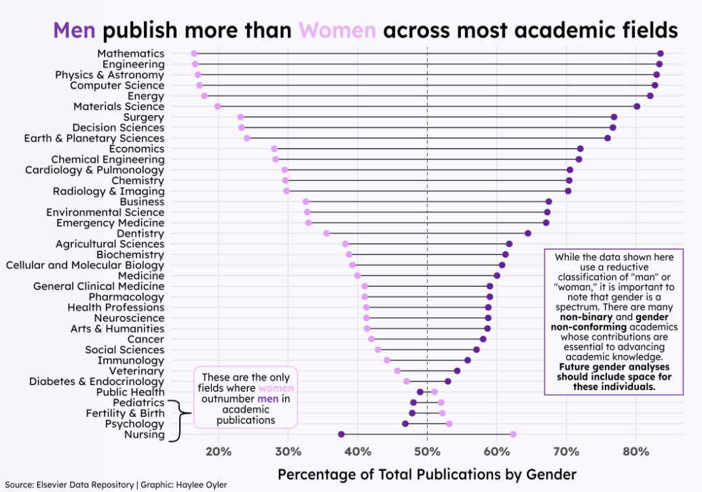
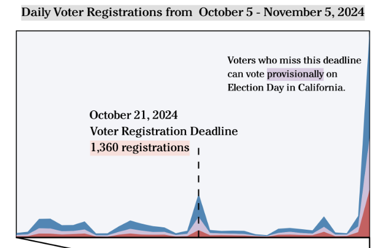
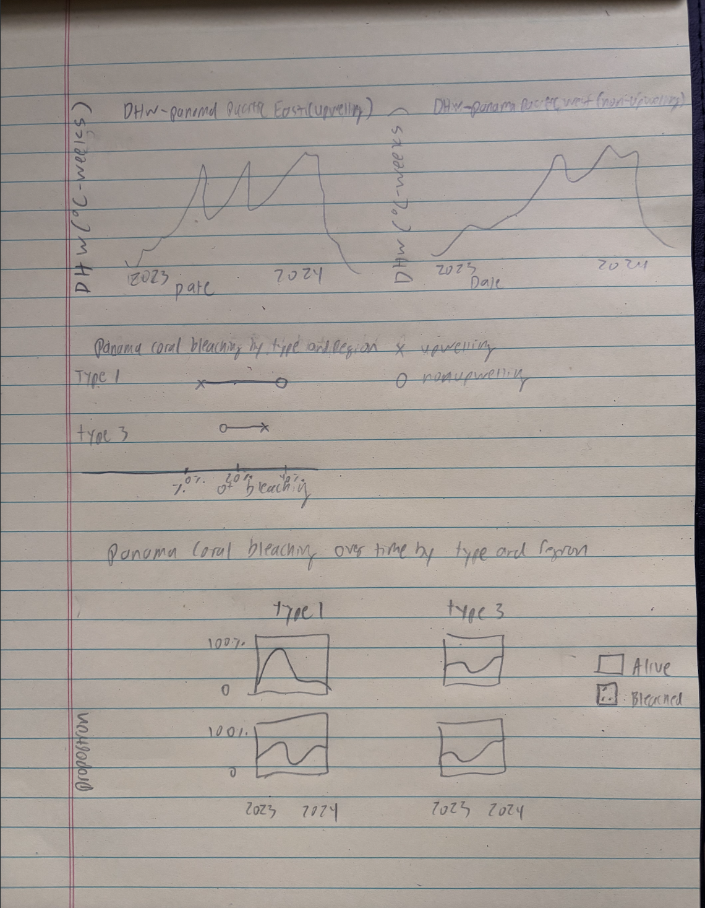

## Pre-planning 

1. Restate the questions you hope to answer with your infographic. This should include one overarching question (think of this as driving the overall theme of your infographic) and at least three subquestions (each of which will be addressed by your infographic’s component visualizations). Have these questions changed at all since FPM #1? If yes, how so?

Overarching question:
How do coral bleaching percentages between differ between upwelling and non-upwelling zones in Panama's Pacific. 

Sub-question 1: 
How have ocean temperatures varied before, during, and after mass bleaching events in upwelling vs non-upwelling zones.  

Sub-question 2: 
How do coral bleaching percentages between type 1 Pocilopora and type 3 Pocilopora differ between upwelling and non-upwelling zones in Panama's Pacific. 

Sub-question 3: 
How have coral bleaching percentages between type 1 and type 3 Polcilopora varied before, during, and after mass bleaching events in upwelling vs non-upwelling zones.

My question did change. I was originally comparing bleaching between all Pocilopora types. Upon consulting with my previous PI, however, I learned that I should represent bleaching between type 1 and type 3 Pocilopora separately because they respond differently to warming ocean temperatures. 

2. Explain which variables from your data set(s) you will use to answer the above questions, and how.

I have two data sets, one containing a Degree Heating Weeks (DHW) column over time for an upwelling and non-upwelling zones in Panama's Pacific. DHW represents accumulated heat stress over a 12-week period when ocean temperatures exceed a coral bleaching threshold. Values are measured in °C-weeks, where higher values mean there is a greater bleaching risk. I will use this column along with the time column to show how bleaching risk change over time between upwelling and non-upwelling zones.

The second data set comes from the Connolly Lab at the Smithsonian Tropical Research Institute. It has point data where each point corresponds to a grid point placed on a coral reef orthomosaic. Each point is tagged as one of the following classes: bleached, dead, or alive. Also, each point is labeled as either type 1 or 3 Pocilopora. I will use the number of rows in each class to calculate the coral bleaching percentages for type 1 and type 3 Pocilopora in upwelling vs non-upwelling zones in Panama across time. 


3. In FPM #2, you created some exploratory data viz to better understand your data. You may already have some ideas of how you plan to formally visualize your data, but it’s incredibly helpful to look at visualizations by other creators for inspiration. Find at least two data visualizations that you could (potentially) borrow / adapt pieces from. Download and embed them into your drafting-viz.qmd file, and explain which elements you might borrow (e.g. the graphic form, legend design, layout, etc.).

I might borrow this dumbbell plot to easily visualize two categorical variables (Coral Type and Upwelling Status) and one continuous variable (Coral Bleaching Percentage). 
```{r}
#| eval: true
#| echo: false
#| fig-align: "center"
#| out-width: "100%"
#| fig-alt: "Alt text here"

```

From this plot, I was inspired by the stream flow chart. I liked how it visualized different variables across time. I'll likely modify mine to be a stacked area chart instead because I'll only want to visualize two variables (Bleached vs Alive coral), also it's easier to see the difference between the two with a stacked area chart. 
```{r}
#| eval: true
#| echo: false
#| fig-align: "center"
#| out-width: "100%"
#| fig-alt: "Alt text here"

```

## Hand-draw anticipated visualizations
Hand-draw your anticipated visualizations, then take a photo of your drawing(s) and embed it in your rendered drafting-viz.qmd file – note that these are not exploratory visualizations, but rather your plan for your final visualizations that you will eventually polish and include in your infographic.

```{r}
#| eval: true
#| echo: false
#| fig-align: "center"
#| out-width: "100%"
#| fig-alt: "Alt text here"

```

## Recreate hand-drawn visualizations using code

```{r, message=FALSE}
library(tidyverse)
library(here)
library(janitor)
library(showtext)
library(glue)
library(ggtext)
library(arrow)
```

## Read in NOAA Time Series Data 

```{r}
# Read in Eastern Panama Data 

p_east_lines <- readLines(here("data","panama_pacific_east.txt")) # Create a vector containing each row

p_east_skip_rows <- which(grepl("YYYY MM DD", p_east_lines)) # Finds rows before date

ts_window <- 84 # Remove first 12 weeks for an accurate DHW rolling value 

# Read the data
panama_east <- read.table(here("data", "panama_pacific_east.txt"), 
                     skip = p_east_skip_rows + ts_window, # Skip non row information at the top of the dataset and first 12 weeks 
                     header = FALSE,
                     col.names = c("year", "month", "day", "sst_min", "sst_max", # Add column names
                                   "sst_90th_hs", "ssta_90th_hs", "hs_90th", 
                                   "dhw", "baa_7day_max")) %>% 
  mutate(site = "panama_east", upwelling = TRUE)

```

```{r}
# Read in Western Panama Data 

p_west_lines <- readLines(here("data","panama_pacific_west.txt")) # Create a vector containing each row

p_west_skip_rows <- which(grepl("YYYY MM DD", p_west_lines)) # Finds rows before date

# Read the data
panama_west <- read.table(here("data", "panama_pacific_west.txt"), 
                     skip = p_west_skip_rows + ts_window, # Skip non row information at the top of the dataset and first 12 weeks 
                     header = FALSE,
                     col.names = c("year", "month", "day", "sst_min", "sst_max", # Add column names
                                   "sst_90th_hs", "ssta_90th_hs", "hs_90th", 
                                   "dhw", "baa_7day_max")) %>% 
  mutate(site = "panama_west", upwelling = FALSE)

```

# Visualize DHW for Upwelling and Non-Upwelling Zones in Panama Over Time 
The following exploratory analysis will explore Degree Heating Weeks (DHW) over time. DHW represents accumulated heat stress over a 12-week period when ocean temperatures exceed a coral bleaching threshold. Values are measured in °C-weeks, where higher values mean there is a greater bleaching risk.

```{r}
panama_east %>% 
ggplot(aes(x = year, y = dhw)) +
  geom_line(color = "darkblue") +
  geom_hline(yintercept = 4, linetype = "dashed", color = "orange") + # First bleaching threshold 
  geom_hline(yintercept = 8, linetype = "dashed", color = "red") + # Second critical bleaching threshold
  labs(title = "DHW - Panama Pacific East (Upwelling)",
       x = "Date", y = "DHW (°C-weeks)") +
  theme_minimal()

```

```{r}
panama_west %>% 
ggplot(aes(x = year, y = dhw)) +
  geom_line(color = "darkblue") +
  geom_hline(yintercept = 4, linetype = "dashed", color = "orange") + # First bleaching threshold
  geom_hline(yintercept = 8, linetype = "dashed", color = "red") + # Second critical bleaching threshold
  labs(title = "DHW - Panama Pacific West (Non-Upwelling)",
       x = "Date", y = "DHW (°C-weeks)") +
  theme_minimal()
```

## Coral bleaching point data analysis

```{r, warning=FALSE, message=FALSE}
# Load in bleached data point data 
bleaching_point_data <- read_parquet(here("data", "point_data.parquet"))
```


```{r, warning=FALSE, message=FALSE}
# Clean data and get coral bleaching percentages per plot piece 
grouped_point_data <- bleaching_point_data %>% 
  filter(year != 2022) %>% 
  filter(year != 2025) %>% 
  filter(class != "Background") %>% 
  filter(class != "Unknown") %>% 
  filter(class != "Dead") %>% 
  mutate(class = if_else(str_detect(class, "Bleached"),
                        "Bleached", class)) %>% 
  group_by(region, site, piece, type, class) %>% 
  summarise(n = n()) %>% 
  ungroup() %>% 
  complete(nesting(region, site, piece, type), class, fill = list(n = 0)) %>%  
  group_by(region, site, piece, type) %>% 
  mutate(prop_bleached = n / sum(n)) %>% 
  ungroup()
```

```{r, warning=FALSE, message=FALSE}
# Get bleaching percentage average between regions
region_bleach_prop <- grouped_point_data %>% 
  group_by(region, type, class) %>% 
  summarise(prop_bleached_avg = mean(prop_bleached))
```

```{r, warning=FALSE, message=FALSE}
# Create line graph comparing bleaching estimates between type and region 
region_bleach_prop %>%
  filter(class == "Bleached") %>%
  ggplot(aes(x = region, y = prop_bleached_avg, 
             group = type, color = type)) +
  geom_line(linewidth = 2.5, alpha = 0.9) +
  geom_point(size = 6) +
  geom_text(aes(label = scales::percent(prop_bleached_avg, accuracy = 1)),
            nudge_x = 0.12, nudge_y = 0.01,
            fontface = "bold", size = 5, color = "white") +
  scale_y_continuous(labels = scales::percent_format(),
                     limits = c(0, 0.75)) +
  scale_color_manual(values = c("Type 1" = "#E07B4F", "Type 3" = "#4F8FE0")) +
  scale_x_discrete(expand = c(0.2, 0.2)) +
  labs(
    title = "Bleaching Proportion by Coral Type Across Regions",
    subtitle = "Lines crossing reveal opposite bleaching responses to upwelling",
    x = NULL,
    y = "Proportion Bleached",
    color = "Coral Type"
  ) +
  theme_minimal(base_size = 10) +
  theme(
    plot.background = element_rect(fill = "#0a1628", color = NA),
    panel.background = element_rect(fill = "#0a1628", color = NA),
    legend.background = element_rect(fill = "#0a1628", color = NA),
    legend.text = element_text(color = "white"),
    legend.title = element_text(color = "white"),
    axis.text = element_text(color = "white", face = "bold"),
    axis.title = element_text(color = "white"),
    panel.grid.minor = element_blank(),
    panel.grid.major.x = element_blank(),
    panel.grid.major.y = element_line(color = "#1e3a5f"),
    plot.title = element_text(color = "white", face = "bold", hjust = 0.5),
    plot.subtitle = element_text(color = "gray60", hjust = 0.5)

  )
```

```{r, warning=FALSE, message=FALSE}
# Build timed grouped data
time_grouped <- bleaching_point_data %>% 
  filter(year != 2022) %>% 
  filter(year != 2025) %>% 
  filter(class != "Background") %>% 
  filter(class != "Unknown") %>% 
  filter(class != "Dead") %>% 
  mutate(
    class = if_else(str_detect(class, "Bleached"), "Bleached", class),
    survey_date = floor_date(date, "month")
  ) %>% 
  group_by(region, site, piece, type, class, survey_date) %>% 
  summarise(n = n()) %>% 
  ungroup() %>%
  complete(nesting(region, site, piece, type, survey_date), class, fill = list(n = 0)) %>%
  group_by(region, site, piece, type, survey_date) %>%
  mutate(prop_bleached = n / sum(n)) %>%
  ungroup()

# Aggregate to region/type/date
time_bleach_prop <- time_grouped %>%
  group_by(region, type, survey_date, class) %>%
  summarise(prop_bleached_avg = mean(prop_bleached)) %>%
  ungroup() 

# Plot stacked area chart 
time_bleach_prop %>%
  mutate(region = recode(region,
                         "Las Perlas" = "Upwelling",
                         "Coiba" = "Non-Upwelling")) %>%
  ggplot(aes(x = survey_date, y = prop_bleached_avg,
             fill = class, group = interaction(class, type))) +
  geom_area(alpha = 0.85, position = "stack") +
  facet_grid(region ~ type) +
  scale_y_continuous(labels = scales::percent_format(), limits = c(0, 1)) +
  scale_x_date(date_labels = "%b %Y", date_breaks = "2 months") +
  scale_fill_manual(values = c("Alive" = "#8B6914", "Bleached" = "#D4CFC4")) +
  labs(
    title = "Coral Bleaching Over Time by Region and Type",
    subtitle = "Coral show large percentage of bleaching recovery across upwelling and non-upwelling regions and coral types",
    x = NULL,
    y = "Proportion",
    fill = NULL
  ) +
  theme_minimal(base_size = 10) +
  theme(
    plot.background = element_rect(fill = "#0a1628", color = NA),
    panel.background = element_rect(fill = "#0a1628", color = NA),
    legend.background = element_rect(fill = "#0a1628", color = NA),
    legend.text = element_text(color = "white"),
    strip.text = element_text(color = "white", face = "bold"),
    strip.background = element_rect(fill = "#0a1628"),
    axis.text = element_text(color = "white"),
    axis.text.x = element_text(angle = 45, hjust = 1),
    axis.title = element_text(color = "white"),
    panel.grid.major = element_line(color = "#1e3a5f"),
    panel.grid.minor = element_blank(),
    plot.title = element_text(color = "white", face = "bold", hjust = 0.5),
    plot.subtitle = element_text(color = "gray60", hjust = 0.5)
  )
```

## Answer a few last questions about work and progress

1. What are the key insights you want your infographic to communicate, and how will your design choices help highlight and support those messages?
I want my infographic to show how bleaching varies across coral type and upwelling status in Panama's pacific. My design choices support that by visualizing ocean heating and bleaching in separate ways across regions and coral types. 

2. What challenges did you encounter or anticipate encountering as you continue to build / iterate on your visualizations in R? If you struggled with mocking up any of your three visualizations, describe those challenges here.
I have had trouble getting degree heating week plots that show change across 2023 and 2024. I see changes in this variable when I plot the full time range from 1990 to present day. However, If I just filter for 2023 and 2024 I don't see the change. Im going to further investigate what this variable means and ensure I'm visualizing it correctly in order to achieve a visualization for only 2023 and 2024. 

3. What ggplot extension tools / packages do you need to use to build your visualizations? Are there any that we haven’t covered in class that you’ll be learning how to use for your visualizations?

I need to use font tools to create visually appealing plots that are easy to read. I have not encountered any I have not learned in class yet. 

4. What feedback do you need from the instructional team and / or your peers to ensure that your intended message and key insights are clear?
I might just need feedback on if they plots I created are easy to understand or if I am attempting to represent too much on a single plot. 


